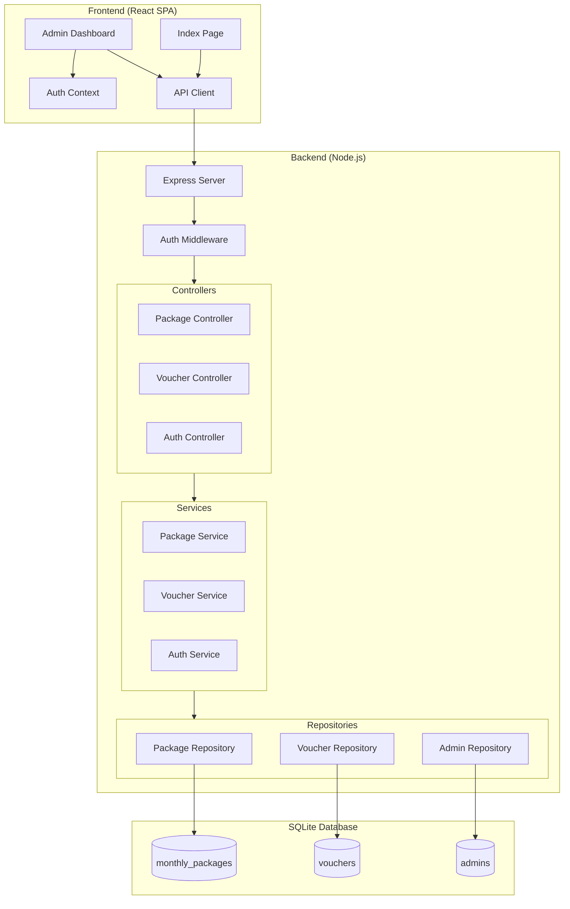
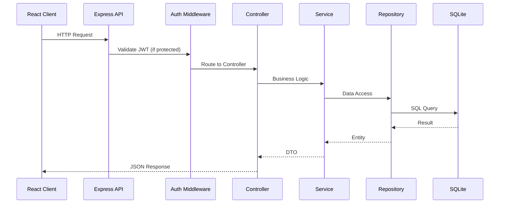

# Design Document: RAF NET ISP Website

## Overview

The RAF NET ISP Website is a full-stack web application consisting of a React Single Page Application (SPA) frontend and a Node.js REST API backend with SQLite database. The system provides a public landing page for customers and a protected admin dashboard for managing internet packages and vouchers.

The architecture follows a clear separation of concerns with:
- **Frontend**: React SPA with HeroUI components, handling routing and state management
- **Backend**: Node.js Express API with service/repository pattern
- **Database**: SQLite for lightweight, file-based persistence

## Architecture



### Request Flow



## Components and Interfaces

### Frontend Components

#### API Client
```typescript
interface ApiClient {
  // Public endpoints
  getActivePackages(): Promise<Package[]>;
  
  // Auth endpoints
  login(credentials: LoginCredentials): Promise<AuthResponse>;
  logout(): void;
  
  // Protected endpoints (require JWT)
  getPackages(): Promise<Package[]>;
  createPackage(data: CreatePackageDTO): Promise<Package>;
  updatePackage(id: number, data: UpdatePackageDTO): Promise<Package>;
  deletePackage(id: number): Promise<void>;
  
  getVouchers(): Promise<Voucher[]>;
  createVoucher(data: CreateVoucherDTO): Promise<Voucher>;
  updateVoucher(id: number, data: UpdateVoucherDTO): Promise<Voucher>;
  deleteVoucher(id: number): Promise<void>;
}
```

#### Auth Context
```typescript
interface AuthContextValue {
  user: AdminUser | null;
  token: string | null;
  isAuthenticated: boolean;
  login(credentials: LoginCredentials): Promise<void>;
  logout(): void;
}
```

### Backend Interfaces

#### Controllers
```typescript
interface PackageController {
  getAll(req: Request, res: Response): Promise<void>;
  getActive(req: Request, res: Response): Promise<void>;
  getById(req: Request, res: Response): Promise<void>;
  create(req: Request, res: Response): Promise<void>;
  update(req: Request, res: Response): Promise<void>;
  delete(req: Request, res: Response): Promise<void>;
}

interface VoucherController {
  getAll(req: Request, res: Response): Promise<void>;
  getById(req: Request, res: Response): Promise<void>;
  create(req: Request, res: Response): Promise<void>;
  update(req: Request, res: Response): Promise<void>;
  delete(req: Request, res: Response): Promise<void>;
}

interface AuthController {
  login(req: Request, res: Response): Promise<void>;
  me(req: Request, res: Response): Promise<void>;
}
```

#### Services
```typescript
interface PackageService {
  findAll(): Promise<Package[]>;
  findActive(): Promise<Package[]>;
  findById(id: number): Promise<Package | null>;
  create(data: CreatePackageDTO): Promise<Package>;
  update(id: number, data: UpdatePackageDTO): Promise<Package>;
  delete(id: number): Promise<boolean>;
}

interface VoucherService {
  findAll(): Promise<Voucher[]>;
  findById(id: number): Promise<Voucher | null>;
  create(data: CreateVoucherDTO): Promise<Voucher>;
  update(id: number, data: UpdateVoucherDTO): Promise<Voucher>;
  delete(id: number): Promise<boolean>;
  isCodeUnique(code: string, excludeId?: number): Promise<boolean>;
}

interface AuthService {
  authenticate(username: string, password: string): Promise<AuthResult>;
  verifyToken(token: string): Promise<TokenPayload | null>;
  hashPassword(password: string): Promise<string>;
  comparePassword(password: string, hash: string): Promise<boolean>;
}
```

#### Repositories
```typescript
interface PackageRepository {
  findAll(): Promise<PackageEntity[]>;
  findActive(): Promise<PackageEntity[]>;
  findById(id: number): Promise<PackageEntity | null>;
  create(data: CreatePackageData): Promise<PackageEntity>;
  update(id: number, data: UpdatePackageData): Promise<PackageEntity | null>;
  delete(id: number): Promise<boolean>;
}

interface VoucherRepository {
  findAll(): Promise<VoucherEntity[]>;
  findById(id: number): Promise<VoucherEntity | null>;
  findByCode(code: string): Promise<VoucherEntity | null>;
  create(data: CreateVoucherData): Promise<VoucherEntity>;
  update(id: number, data: UpdateVoucherData): Promise<VoucherEntity | null>;
  delete(id: number): Promise<boolean>;
}

interface AdminRepository {
  findByUsername(username: string): Promise<AdminEntity | null>;
  findById(id: number): Promise<AdminEntity | null>;
  create(data: CreateAdminData): Promise<AdminEntity>;
}
```

## Data Models

### Database Schema

```sql
-- Monthly Packages Table
CREATE TABLE monthly_packages (
  id INTEGER PRIMARY KEY AUTOINCREMENT,
  name TEXT NOT NULL,
  speed TEXT NOT NULL,
  price REAL NOT NULL,
  description TEXT,
  is_active INTEGER DEFAULT 1,
  created_at TEXT DEFAULT CURRENT_TIMESTAMP,
  updated_at TEXT DEFAULT CURRENT_TIMESTAMP
);

-- Vouchers Table
CREATE TABLE vouchers (
  id INTEGER PRIMARY KEY AUTOINCREMENT,
  code TEXT NOT NULL UNIQUE,
  duration TEXT NOT NULL,
  price REAL NOT NULL,
  is_active INTEGER DEFAULT 1,
  created_at TEXT DEFAULT CURRENT_TIMESTAMP,
  updated_at TEXT DEFAULT CURRENT_TIMESTAMP
);

-- Admins Table
CREATE TABLE admins (
  id INTEGER PRIMARY KEY AUTOINCREMENT,
  username TEXT NOT NULL UNIQUE,
  password_hash TEXT NOT NULL,
  role TEXT DEFAULT 'admin',
  created_at TEXT DEFAULT CURRENT_TIMESTAMP
);
```

### TypeScript Types

```typescript
// Domain Entities
interface Package {
  id: number;
  name: string;
  speed: string;
  price: number;
  description: string | null;
  isActive: boolean;
  createdAt: Date;
  updatedAt: Date;
}

interface Voucher {
  id: number;
  code: string;
  duration: string;
  price: number;
  isActive: boolean;
  createdAt: Date;
  updatedAt: Date;
}

interface AdminUser {
  id: number;
  username: string;
  role: string;
}

// DTOs
interface CreatePackageDTO {
  name: string;
  speed: string;
  price: number;
  description?: string;
  isActive?: boolean;
}

interface UpdatePackageDTO {
  name?: string;
  speed?: string;
  price?: number;
  description?: string;
  isActive?: boolean;
}

interface CreateVoucherDTO {
  code: string;
  duration: string;
  price: number;
  isActive?: boolean;
}

interface UpdateVoucherDTO {
  code?: string;
  duration?: string;
  price?: number;
  isActive?: boolean;
}

interface LoginCredentials {
  username: string;
  password: string;
}

interface AuthResponse {
  token: string;
  user: AdminUser;
}

// Validation Schemas
interface ValidationError {
  field: string;
  message: string;
}

interface ApiError {
  status: number;
  message: string;
  errors?: ValidationError[];
}
```


## Correctness Properties

*A property is a characteristic or behavior that should hold true across all valid executions of a system—essentially, a formal statement about what the system should do. Properties serve as the bridge between human-readable specifications and machine-verifiable correctness guarantees.*

### Property 1: Package CRUD Round-Trip

*For any* valid package data (name, speed, price, description), creating a package and then retrieving all packages should return a list containing a package with the same data.

**Validates: Requirements 3.1, 3.2**

### Property 2: Package Update Persistence

*For any* existing package and valid update data, updating the package and then retrieving it by ID should return the package with the updated values.

**Validates: Requirements 3.3, 3.5**

### Property 3: Package Delete Removes Record

*For any* existing package, deleting it and then attempting to retrieve it by ID should return null/not found.

**Validates: Requirements 3.4**

### Property 4: Voucher CRUD Round-Trip

*For any* valid voucher data (code, duration, price), creating a voucher and then retrieving all vouchers should return a list containing a voucher with the same data.

**Validates: Requirements 4.1, 4.2**

### Property 5: Voucher Update Persistence

*For any* existing voucher and valid update data, updating the voucher and then retrieving it by ID should return the voucher with the updated values.

**Validates: Requirements 4.3, 4.5**

### Property 6: Voucher Delete Removes Record

*For any* existing voucher, deleting it and then attempting to retrieve it by ID should return null/not found.

**Validates: Requirements 4.4**

### Property 7: Voucher Code Uniqueness

*For any* two vouchers in the database, their codes must be different. Attempting to create a voucher with a duplicate code should fail with a validation error.

**Validates: Requirements 4.7, 7.5**

### Property 8: Authentication Correctness

*For any* admin user with stored credentials, authenticating with the correct password should succeed and return a valid JWT token, while authenticating with any incorrect password should fail.

**Validates: Requirements 2.1, 2.2**

### Property 9: Password Hash Security

*For any* password, the stored hash should differ from the plaintext password, and the hash should be verifiable against the original password using bcrypt comparison.

**Validates: Requirements 2.5**

### Property 10: Active Package Filtering

*For any* set of packages with mixed active/inactive status, the public endpoint should return only packages where is_active is true, and no inactive packages should appear in the result.

**Validates: Requirements 1.3, 1.5**

### Property 11: Protected Route Authorization

*For any* request to a protected endpoint with a valid non-expired JWT token, the request should be authorized. For any request without a token or with an invalid token, the request should be rejected with 401.

**Validates: Requirements 2.3, 6.1**

### Property 12: Token Expiration Rejection

*For any* expired JWT token, requests to protected endpoints should be rejected with 401 and require re-authentication.

**Validates: Requirements 2.4**

### Property 13: Validation Error Response

*For any* invalid input data (missing required fields, wrong types, constraint violations), the API should return a 400 status with specific field-level error messages.

**Validates: Requirements 3.6, 4.6, 6.3**

### Property 14: SQL Injection Prevention

*For any* input containing SQL injection patterns (e.g., `'; DROP TABLE --`), the input should be safely handled without executing malicious SQL, and the database should remain intact.

**Validates: Requirements 6.2, 6.4**

## Error Handling

### API Error Response Format

All API errors follow a consistent format:

```typescript
interface ApiErrorResponse {
  status: number;
  message: string;
  errors?: ValidationError[];
}

interface ValidationError {
  field: string;
  message: string;
}
```

### HTTP Status Codes

| Status | Usage |
|--------|-------|
| 200 | Successful GET, PUT requests |
| 201 | Successful POST (resource created) |
| 204 | Successful DELETE (no content) |
| 400 | Validation errors, malformed requests |
| 401 | Authentication required or failed |
| 403 | Forbidden (insufficient permissions) |
| 404 | Resource not found |
| 409 | Conflict (e.g., duplicate voucher code) |
| 500 | Internal server error |

### Error Handling Strategy

1. **Validation Errors**: Caught at controller level, return 400 with field-specific errors
2. **Authentication Errors**: Caught by auth middleware, return 401
3. **Not Found Errors**: Caught at service level, return 404
4. **Conflict Errors**: Caught at repository level (unique constraint), return 409
5. **Unexpected Errors**: Caught by global error handler, log details, return 500 with generic message

### Frontend Error Handling

- Display validation errors inline with form fields
- Show toast notifications for success/error operations
- Redirect to login on 401 responses
- Display user-friendly error messages (never expose technical details)

## Testing Strategy

### Testing Framework

- **Backend**: Jest with Supertest for API testing
- **Frontend**: Jest with React Testing Library
- **Property-Based Testing**: fast-check library for TypeScript

### Dual Testing Approach

Both unit tests and property-based tests are required for comprehensive coverage:

- **Unit tests**: Verify specific examples, edge cases, and error conditions
- **Property tests**: Verify universal properties across randomly generated inputs

### Test Configuration

- Property tests: Minimum 100 iterations per property
- Each property test must reference its design document property
- Tag format: `Feature: raf-net-isp-website, Property {number}: {property_text}`

### Test Categories

#### Unit Tests
- Repository methods with mock database
- Service business logic
- Controller request/response handling
- Validation functions
- JWT token generation/verification
- React component rendering
- Form validation

#### Property-Based Tests
- Package CRUD operations (Properties 1-3)
- Voucher CRUD operations (Properties 4-6)
- Voucher code uniqueness (Property 7)
- Authentication flow (Property 8)
- Password hashing (Property 9)
- Active package filtering (Property 10)
- Authorization middleware (Properties 11-12)
- Input validation (Property 13)
- SQL injection prevention (Property 14)

#### Integration Tests
- Full API request/response cycles
- Database initialization
- Authentication flow end-to-end

### Test File Structure

```
backend/
  src/
    repositories/
      __tests__/
        package.repository.test.ts
        voucher.repository.test.ts
    services/
      __tests__/
        package.service.test.ts
        voucher.service.test.ts
        auth.service.test.ts
    controllers/
      __tests__/
        package.controller.test.ts
        voucher.controller.test.ts
    __tests__/
      properties/
        package.property.test.ts
        voucher.property.test.ts
        auth.property.test.ts

frontend/
  src/
    components/
      __tests__/
        PackageTable.test.tsx
        VoucherTable.test.tsx
    pages/
      __tests__/
        Index.test.tsx
        AdminDashboard.test.tsx
```
